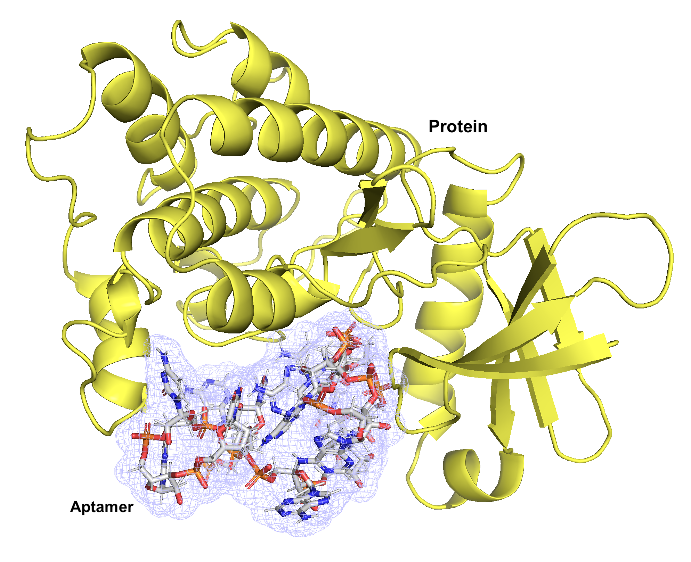

# AptGAN
de novo generation of RNA aptamers for protein targets using generative adversarial network-based deep learning approach


## Requirements
* Python 3.8
* torch
* tensorflow
* numpy
* pandas
* xgboost
* propy
* RNA
* repDNA
* sklearn
* pickle
* random
* optuna
* matplotlib

You can install the dependencies with the versioins specified in requirements.txt. 

## Usage
You can generate aptamers using AptGAN with the following parameters:

--type: 0 (generate aptamer sequences)/ 1(generate apramers for protein)

--seq_num: the number of generated sequences

--seq_min: the minimum length of generated sequences

--seq_max: the maximum length of generated sequences

--path: the folder for generated results

```
$ python main.py --type 0 --seq_num 10 --seq_min 20 --seq_max 120 --path './dataset/'
```

You can generate aptamers for your target protein using AptGAN with the following additional parameters:

-threshold: binding affinity threshold (default: 0.6)

--pro_file: path of protein sequence in FASTA format

--pro_ss: path of protein secondary structural file (check the generation method below)

```
$ python main.py --type 1 --seq_num 10 --seq_min 20 --seq_max 120 --threshold 0.6 --path './dataset/' --pro_file './dataset/sota/CREB3/CREB3.fasta' --pro_ss './dataset/sota/CREB3/CREB3_SS.fas'
```

You can generate the secondary structural file of a protein sequence (in FASTA format) using [s4pred](https://github.com/psipred/s4pred), e.g.:

--outfmt: fas (FASTA format)
followed by "path of protein sequence", and "output path of protein secondary structural file"

```
$ python ./s4pred/run_model.py --outfmt fas ./dataset/sota/CREB3/CREB3.fasta >./dataset/sota/CREB3/CREB3.fas
```


## SOTA
The source code and generated sequences used in SOTA comparisons are provided [Zenodo](https://zenodo.org/records/14862169).


## Citation


